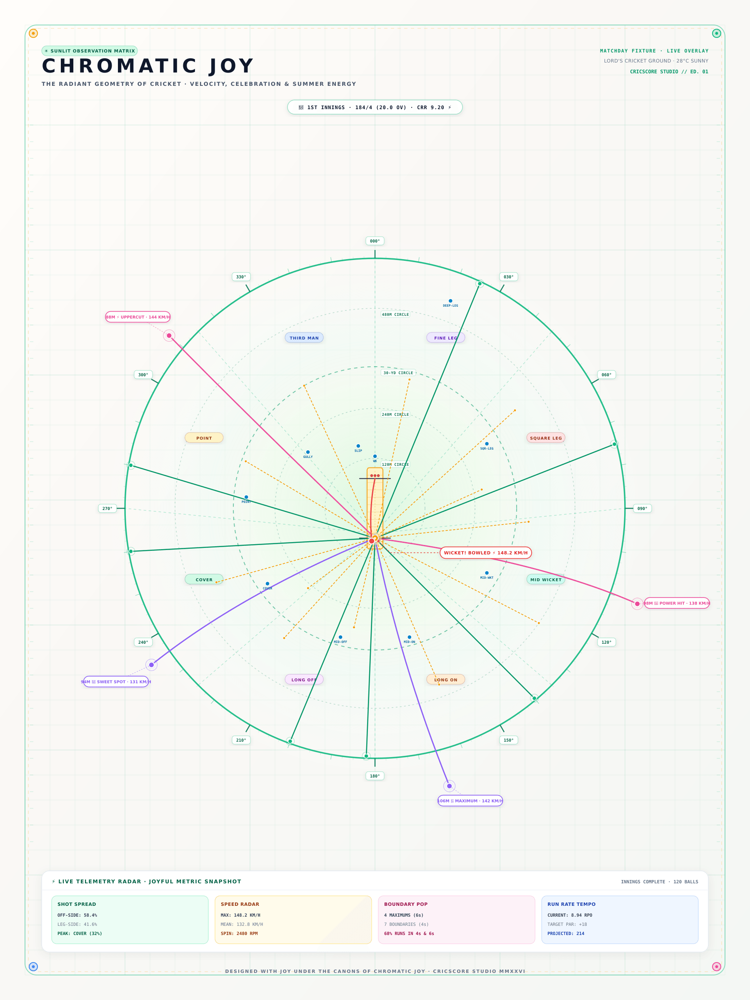

# Chromatic Joy

_A Manifesto of Sunlit Space, Playful Momentum, and Vibrant Geometric Delight_

Chromatic Joy posits that sport and data observation are fundamentally celebrations of human vitality, meant to be experienced in full sunlight with lightness, optimism, and uninhibited delight. Space is conceived not as a sterile void or dark chamber, but as an open, sun-drenched canvas alive with air, brightness, and warmth. Forms possess natural buoyancy—curves are generous and rounded, trajectories arc with playful exuberance, and concentric boundaries petal outward like summer flowers under open skies. Every radius and sweeping contour is meticulously crafted, achieving a weightless harmony that reveals the product of deep expertise, where mathematical precision meets the infectious exuberance of play.

The material and chromatic language banishes nocturnal gloom in favor of a radiant, tactile daylight palette. Crisp porcelain white and sun-bleached cream grounds provide a luminous stage for high-spirited, intentional color accents—lush spring turf green, effervescent citrus orange, pure ozone sky blue, and vibrant berry pops. Colors are never murky or decorative filler; each tone is calibrated with painstaking attention to visual delight and contrast, creating an instantaneous emotional lift. The surface carries the tactile cheer of risograph printmaking and fine silk-screen poster art, where vibrant inks sing against warm, paper-textured daylight.

Rhythm in Chromatic Joy mirrors the staccato bounce of a ball, the rhythmic clap of a crowd, and the pulse of celebratory momentum. Scale dances between bold, smiling monumental gestures and delightful micro-accents: buoyant geometric badges, micro-stars, celebratory confetti ticks, and cheerful radial degree notches. Concentric rings expand outward like ripples across water on a bright summer afternoon. This polyphonic cadence demands master-level execution, orchestrating playful visual jumps so that the composition feels alive with kinetic happiness from across the room, while drawing the viewer in with endlessly charming micro-craftsmanship up close.

Balance is dynamic, open-hearted, and buoyant. Rather than rigid monolithic tension, the layout breathes with generous white space and weightless equilibrium. Symmetrical radial structures—inspired by the sacred circularity of the field and the central green sanctuary—are kissed with playful off-axis vectors, bouncy trajectories, and floating celebratory badges. Every millimeter of negative space is labored over with care, ensuring that joy never devolves into visual clutter. The composition retains pristine clarity, feeling effortlessly spontaneous while being the hard-won result of countless hours of rigorous spatial calibration.

Visual hierarchy communicates through cheerful contrast, geometric scale, and crisp spatial separation. Typography is design-forward, welcoming, and delightfully sparse—clean geometric letterforms stripped of self-serious pretense, accompanied by crisp numeric stamps and sunny curatorial captions. Ninety percent of the story is told through radiating arcs, bright color chords, and joyful geometry, with words appearing only as rare, delightful anchors. Chromatic Joy represents the absolute zenith of graphic mastery—a testament that the highest level of craftsmanship can be radiantly uplifting, approachable, and unequivocally fun.
